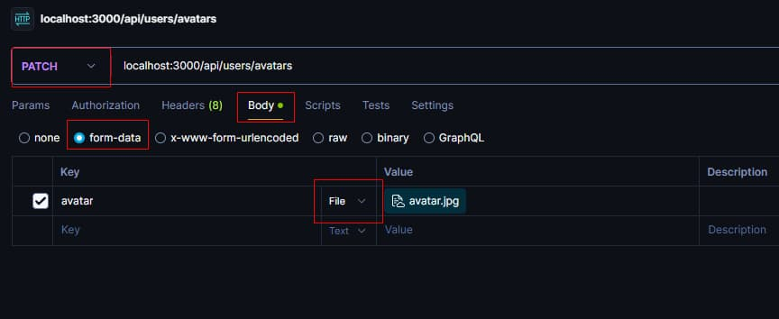

**Читать на других языках: [Українська](./docs/README.ua.md),
[English](./docs/README.en.md).**

# Загрузка файлов (аватарки) пользователя через Multer.

---

Добавление возможности загрузки аватарки пользователя через 'multer'. Генерация
стандартной аватарки при регистрации нового пользователя с помощью библиотеки
gravatar. Добавление и обновление размера аватарки с пакетом 'jimp' или 'sharp'.
Написание unit-тестов для контроллера входа (login/signin) с 'jest'.

---

### 1. Настройка Express на раздачу статических файлов.

1.1. Создается папка **public** для раздачи статики. В этой папке создается
папка **avatars**.

> Важно! Так как пустую папку на гит запушить нельзя, в папке **public/avatars**
> нужно создать файл _`.gitkeep`_.

1.2. Настраивается `Express` на раздачу статических файлов из папки **public**.
Для этого в [app.js](./app.js) добавляется мидлвар
`app.use(express.static('public'));`.

1.3. Для проверки, что раздача статики работает, ложится любое изображение в
папку **public/avatars**. При переходе по такому URL браузер отобразит
изображение.

```js
http://localhost:<порт>/avatars/<имя файла с расширением>
```

---

### 2. Генерация аватара с gravatar.

2.1. В схему пользователя добавляется новое свойство avatarURL для хранения
изображения.

```js
...
avatarURL: {
  type: String,
  required: true,
},
...
```

2.2. Для того чтобы при регистрации нового пользователя сразу сгенерировать ему
аватар по его email используется библиотека
[gravatar](https://www.npmjs.com/package/gravatar).

2.3. Во время создания пользователя, `url`, полученный с помощью `gravatar`,
сохраняется в поле _`avatarURL`_.

---

### 3. Обновление аватарки пользователем. Кастомизация аватара с пакетом jimp или sharp.

3.1. В корне проекта создается папка **temp** для временного хранения
загруженной пользователем аватарки.

3.2. Создается эндпоинт [`/api/users/avatars`](#запрос-на-обновление-аватара).

3.3. Создается и добавляется в маршрут мидлвар
[upload](./middlewares/upload.js), в котором настраивается
`multer.diskStorage({})` для загрузки аватара в папку **temp**.

3.4. Создается и добавляется в маршрут контроллер
[updateAvatar](./controllers/users/updateAvatar.js).

3.5. С помощью [jimp](https://www.npmjs.com/package/jimp) или
[sharp](https://www.npmjs.com/package/sharp) изменяется и задается размер
аватара 250 на 250.

> Важно! Изменять размер аватара нужно именно в папке **temp**, до переноса в
> папку **public/avatars**, чтобы в случае ошибки, файл удалился, и пользователь
> снова мог загрузить его.

3.6. Аватар пользователя переносится в папку **public/avatars**. Задается
уникальное имя для конкретного пользователя.

3.7. Полученный URL `/avatars/<имя файла с расширением>` сохраняется в поле
[avatarURL](#ответ-на-успешное-обновление-аватара) пользователя.

3.8. Запрос пользователя на смену аватара



##### Запрос на обновление аватара

```js
@PATCH /api/users/avatars
Content-Type: multipart/form-data
Authorization: "Bearer {{token}}"
RequestBody: загруженный файл
```

##### Ответ на успешное обновление аватара

```js
Status: 200 OK
Content-Type: application/json
ResponseBody: {
  "avatarURL": "тут будет ссылка на изображение"
}
```

---

## Дополнительное задание

---

### 4. Unit-тестирование контроллера входа (signIn).

4.1. Пишутся unit-тесты для контроллера входа (login/signin) при помощи
[jest](https://www.npmjs.com/package/jest) и
[supertest](https://www.npmjs.com/package/supertest). В _`package.json`_ нужно
вставить в поле `scripts` ключ: "test", значение: "jest".

```json
// package.json
...
"scripts": {
  "start": "cross-env NODE_ENV=production node ./server.js",
  ...
  "test": "jest"
},
...
```

4.2. Для запуска тестов используется команда `yarn test`.

Тест должен пройти следующие пункты:

- Возвращает успешный ответ со статус-кодом 200.
- Проверяет, что токен существует в ответе.
- Проверяет, что токен действительно соответствует пользователю.
- Проверяет, что токен сохраняется у пользователя в MongoDB
- В ответ возвращает пользователя с полями email и subscription.
- Поле email в ответе возвращается строкой.
- Поле email в ответе возвращается строкой.
