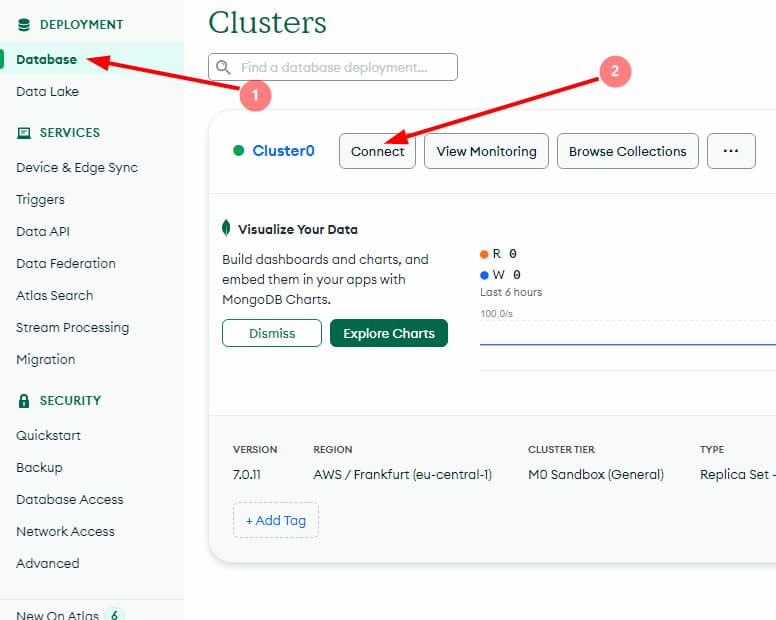
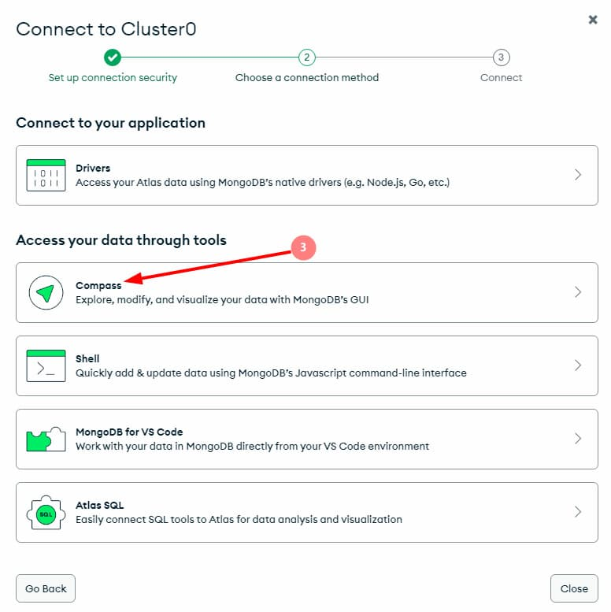
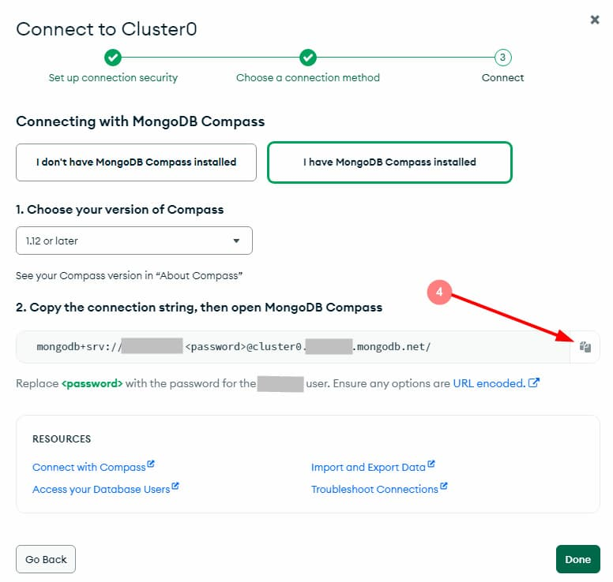
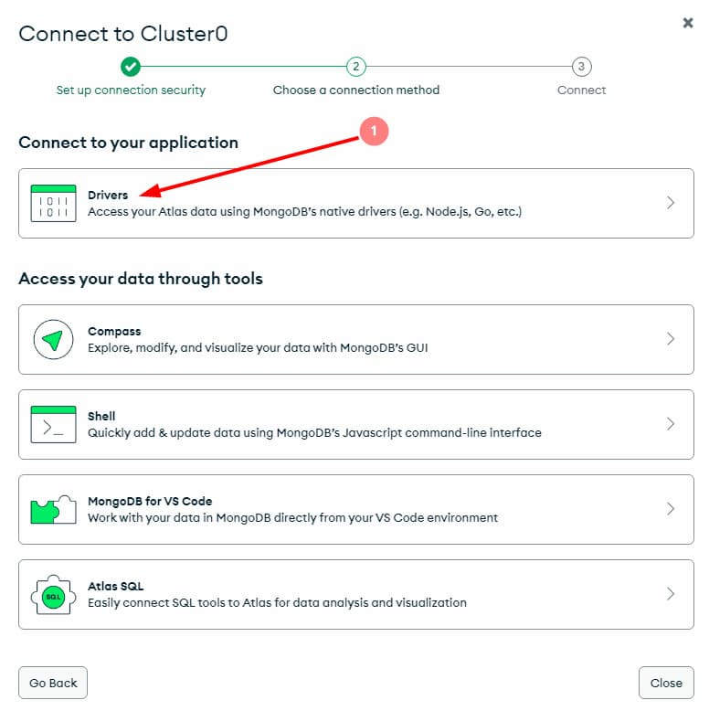
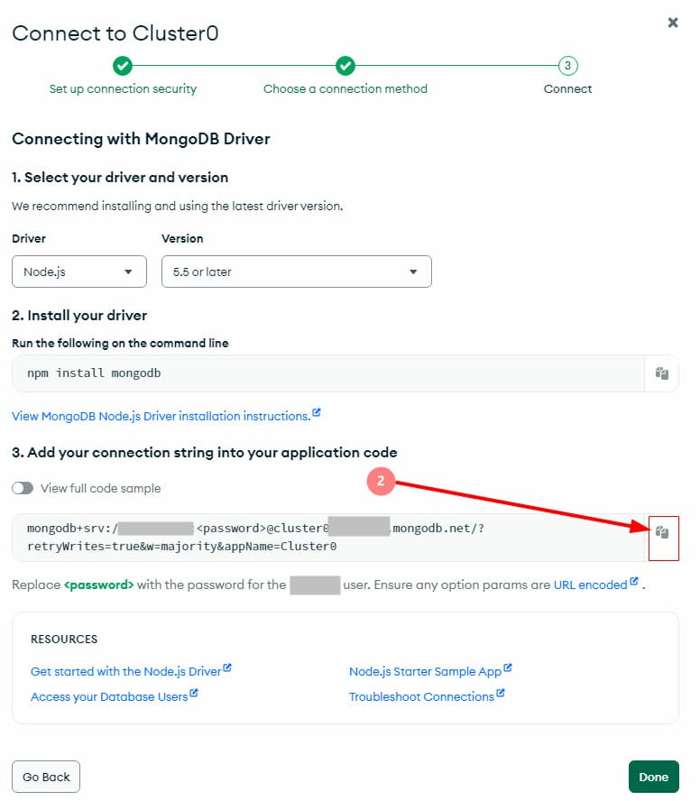

**Читать на других языках: [Українська](./docs/README.ua.md),
[English](./docs/README.en.md).**

# MongoDB и Mongoose.

---

Создание MongoDB базы, установка MongoDB Compass для работы с базой, подключение
к базе с помощью Mongoose. Создание mongoose схемы и модели.

---

### 1. Создание аккаунта на MongoDB Atlas.

Создается аккаунт на **_[MongoDB Atlas](https://www.mongodb.com/)_**. После
этого создается новый проект и настраивается **бесплатный кластер**. Во время
настройки кластера выбирается регион и провайдер наиболее близкий к вашему
месторасположению. Если выбрать слишком отдаленный от вас регион, скорость
ответа сервера будет намного дольше. Далее, в MongoDB Atlas создается
пользователь с правами администратора.

---

### 2. Установка и подключение графического редактора MongoDB Compass.

Устанавливается графический редактор
**_[MongoDB Compass](https://www.mongodb.com/products/tools/compass)_** для
удобной работы с базой данных для MongoDB. Настраивается подключение облачной
базы данных к Compass.







Скопированная строка вставляется в MongoDB Compass url. В строке слово
`<password>` заменяется на пароль от MongoDB.

Через Compass создается база данных _`db-contacts`_ и в ней коллекция
_`contacts`_.

---

### 3. Подключение к MongoDB с помощью Mongoose.

Копируются все файлы и папки с ветки
[rest-api-express](https://github.com/YevhenChementsov/node-full-course/tree/rest-api-express)
и заменяется хранение контактов из json-файла на созданную базу данных. С
помощью команды `yarn remove nanoid` удаляется пакет **nanoid**. Командой
`yarn add cross-env dotenv mongoose` устанавливаются необходимые пакеты для
работы.

> Подробнее о пакетах: [cross-env](https://www.npmjs.com/package/cross-env),
> [dotenv](https://www.npmjs.com/package/dotenv),
> [mongoose](https://www.npmjs.com/package/mongoose).

Меняются скрипты в _`package.json`_ файле.

```json
"scripts": {
    "start": "cross-env NODE_ENV=production node ./server.js",
    "dev": "cross-env NODE_ENV=development nodemon ./server.js"
  },
```

Удаляются папки **db** и **services** со всем содержимым.

В файле _`server.js`_ создается подключение к MongoDB при помощи Mongoose.

- При успешном подключении выводится в консоль сообщение
  `"Database connection successful"`
- При ошибке выводится в консоль сообщение ошибки и завершается процесс с
  помощью process.exit(1)

```js
// server.js
const mongoose = require('mongoose');

const app = require('./app');

const { DB_HOST, PORT = 3000 } = process.env;

mongoose.set('strictQuery', true);

mongoose
  .connect(DB_HOST)
  .then(() => {
    console.log('Database connection successful');
    app.listen(PORT, () => {
      console.log(`Server running. Use our API on port: ${PORT}`);
    });
  })
  .catch(error => {
    console.log(error.message);
    process.exit(1);
  });
```

В переменную окружения _`DB_HOST`_ в файле _`.env`_ вставляется скопированная
строка с MongoDB:

 

Перед знаком вопроса в скопированной строке прописывается название базы данных
_`db-contacts`_

```js
DB_HOST =
  'mongodb+srv://*********:<your password from mongodb>@cluster0.*******.mongodb.net/db-contacts?retryWrites=true&w=majority&appName=Cluster0';
```

> Важно! Внимательно проверить точное название базы данных, так как mongoose при
> подключении не покажет ошибку если название базы данных введено неверно.

В файл _`.env.example`_ добавляется имя переменной _`DB_HOST`_ чтобы знать какая
переменная окружения используется. `DB_HOST=`. В _`app.js`_ добавляется импорт
`require('dotenv').config();` для работы с .env файлом и переменными окружения.

---

### 4. Создание mongoose схемы и модели.
