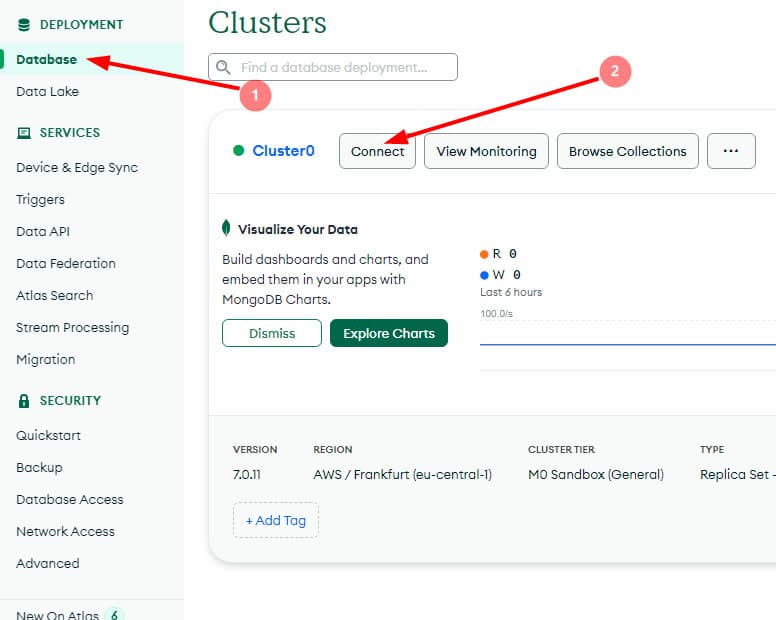

**Читати іншими мовами: [Русский](../README.md), [English](./README.en.md).**

# MongoDB и Mongoose.

---

Створення MongoDB бази, встановлення MongoDB Compass для роботи з базою,
підключення до бази за допомогою Mongoose. Створення mongoose схеми та моделі.

---

### 1. Створення акаунта на MongoDB Atlas.

Створюється акаунт на **_[MongoDB Atlas](https://www.mongodb.com/)_**. Після
цього створюється новий проєкт і налаштовується **безкоштовний кластер**. Під
час налаштування кластера вибирається регіон і провайдер найближчий до вашого
місця розташування. Якщо вибрати занадто віддалений від вас регіон, швидкість
відповіді сервера буде набагато довшою. Далі, в MongoDB Atlas створюється
користувач з правами адміністратора.

---

### 2. Встановлення та підключення графічного редактора MongoDB Compass.

Встановлюється графічний редактор
**_[MongoDB Compass](https://www.mongodb.com/products/tools/compass)_** для
зручної роботи з базою даних для MongoDB. Налаштовується підключення хмарної
бази даних до Compass.




Скопійований рядок вставляється в MongoDB Compass url. У рядку слово
`<password>` замінюється на пароль від MongoDB.

Через Compass створюється база даних _`db-contacts`_ і в ній колекція
_`contacts`_.

---

### 3. Підключення до MongoDB за допомогою Mongoose.

Копіюються всі файли і папки з гілки
[rest-api-express](https://github.com/YevhenChementsov/node-full-course/tree/rest-api-express)
і замінюється зберігання контактів з json-файлу на створену базу даних. С
допомогою команди `yarn remove nanoid` видаляється пакет **nanoid**. Командою
`yarn add cross-env dotenv mongoose` встановлюються необхідні пакети для роботи.

> Детальніше про пакети: [cross-env](https://www.npmjs.com/package/cross-env),
> [dotenv](https://www.npmjs.com/package/dotenv),
> [mongoose](https://www.npmjs.com/package/mongoose).

Змінюються скрипти в _`package.json`_ файлі.

```json
"scripts": {
    "start": "cross-env NODE_ENV=production node ./server.js",
    "dev": "cross-env NODE_ENV=development nodemon ./server.js"
  },
```

Видаляються папки **db** і **services** з усім вмістом.

У файлі _`server.js`_ створюється підключення до MongoDB за допомогою Mongoose.

- У разі успішного підключення виводиться в консоль повідомлення
  `«Database connection successful»`.
- У разі помилки виводиться в консоль повідомлення помилки і завершується процес
  з допомогою process.exit(1)

```js
// server.js
const mongoose = require('mongoose');

const app = require('./app');

const { DB_HOST, PORT = 3000 } = process.env;

mongoose.set('strictQuery', true);

mongoose
  .connect(DB_HOST)
  .then(() => {
    console.log('Database connection successful');
    app.listen(PORT, () => {
      console.log(`Server running. Use our API on port: ${PORT}`);
    });
  })
  .catch(error => {
    console.log(error.message);
    process.exit(1);
  });
```

У змінну оточення _`DB_HOST`_ у файлі _`.env`_ вставляється скопійований рядок з
MongoDB:

 

Перед знаком питання в скопійованому рядку прописується назва бази даних
_`db-contacts`_

```js
DB_HOST =
  'mongodb+srv://*********:<your password from mongodb>@cluster0.*******.mongodb.net/db-contacts?retryWrites=true&w=majority&appName=Cluster0';
```

> Уважно перевірити точну назву бази даних, оскільки mongoose під час
> під'єднання не покаже помилку, якщо назву бази даних введено невірно.

У файл _`.env.example`_ додається ім'я змінної _`DB_HOST`_, щоб знати, яка
змінна оточення використовується - `DB_HOST=`. У _`app.js`_ додається імпорт
`require('dotenv').config();` для роботи з .env файлом і змінними оточення.

---

### 4. Створення схеми моделі контактів.

Створюється файл _`contact.js`_ у папці **models**, у якому зберігатиметься
схема і модель колекції контактів. Для цього імпортується з mongoose схема і
модель:

```js
// contact.js
const { Schema, model } = require('mongoose');
```

Створюється схема моделі для колекції contacts:

```js
// contact.js
const contactSchema = new Schema(
  {
    name: {
      type: String,
      match: nameRegExp,
      required: [true, 'Name is a required field'],
    },
    email: {
      type: String,
      required: [true, 'Email is a required field'],
    },
    phone: {
      type: String,
      match: phoneRegExp,
      required: [true, 'Phone is a required field'],
    },
    favorite: {
      type: Boolean,
      default: false,
    },
  },
  { versionKey: false, timestamps: true },
);
```

Методи mongoose викидають помилку без статусу і тому він за замовчуванням
ставиться `500` (коли доходить до _`app.js`_). Виправляється відображення
статусу за допомогою допомогою функції-хелпера _`handleMongooseError`_, яка
створюється в папці **helpers**.

```js
// helpers/handleMongooseError.js
const handleMongooseError = (error, data, next) => {
  error.status = 400;
  next();
};

module.exports = handleMongooseError;
```

Далі імпортується функція _`handleMongooseError`_, створюється модель і експорт
колекції contacts:

```js
// contact.js
const { handleMongooseError } = require('../helpers');

...

contactSchema.post('save', handleMongooseError);

const Contact = model('contact', contactSchema);

module.exports = Contact;
```

> Перший аргумент моделі має бути ім'я іменник в однині.

---

### 5. Переписування функцій обробки запитів - controllers.

У функціях обробки запитів замінюється код CRUD-операцій над контактами з файлу,
на Mongoose-методи для роботи з колекцією контактів у базі даних. Для цього
імпортується модель **_Contact_**
`const { Contact } = require('.../.../models/contact');` і замінюються на методи
моделі:

- `find()` - знаходить усі контакти
- `findById()` - знаходить контакт за `id`
- create() - створює новий контакт
- findByIdAndUpdate() - повністю перезаписує контакт за `id`
- findByIdAndDelete() - видаляє контакт за `id`

---

### 6. Додавання нового маршруту @ PATCH /api/contacts/:id/favorite

У контактах з'являється додаткове поле статусу _favorite_, яке приймає логічне
значення true або false. Воно відповідає за те, що в обраному чи ні перебуває
зазначений контакт. Реалізується для оновлення статусу контакту новий рут:

<details>
<summary>@ PATCH /api/contacts/:id/favorite</summary>

- Отримує параметр `id`
- Отримує `body` у json-форматі з оновленням поля `favorite`
- Якщо `body` немає, повертає json з ключем {«message»: «missing field
  favorite"} і статусом `400`
- Якщо з `body` все добре, викликає функцію
  _`updateFavorite(id, body, { new: true })`_ (додається до
  /controllers/contacts) для оновлення контакту в базі. Третім аргументом
  передається об'єкт `{ new: true }`, щоб повертався оновлений контакт.
- За результатом роботи функція повертає оновлений об'єкт контакту зі статусом
  `200`. В іншому випадку, повертає json із ключем `«message»: «Not found»` і
  статусом `404`

</details>

---

### 7. Валідація для @ PATCH

Оскільки patch оновлює одне поле, для нього окремо пишеться валідація. Для
зручності, mongoose-валідацію і joi-валідацію краще зберігати в одному файлі.
Тому вміст файлу _`contactsSchema.js`_ з папки **schemas** переноситься до файлу
_`contact.js`_, що міститься в папці **models**, а _`contactsSchema.js`_ і папка
**schemas** видаляються.

```js
// contact.js
const Joi = require('joi');
//* Regular expression for name
const nameRegExp = /^[a-zA-Zа-яА-Я]+(([' -][a-zA-Zа-яА-Я ])?[a-zA-Zа-яА-Я]*)*$/;
//* Regular expression for phone
const phoneRegExp =
  /^\+?\d{0,4}?[-.\s]?\(?\d{1,3}?\)?[-.\s]?\d{1,4}[-.\s]?\d{1,4}[-.\s]?\d{1,9}$/;
//* Joi validation
const addSchema = Joi.object({
  name: Joi.string().pattern(nameRegExp).min(3).max(30).required().messages({
    'string.base': 'Name should be a string',
    'string.pattern.base': 'Name should be a string',
    'string.empty': 'Name cannot be an empty field',
    'string.min': 'Name should have a minimum of {#limit} letters',
    'string.max': 'Name should have a maximum of {#limit} letters',
    'any.required': 'Name is a required field',
  }),
  email: Joi.string()
    .email({ tlds: { allow: false } })
    .required()
    .messages({
      'string.email': 'Please enter a valid email address',
      'string.empty': 'Email cannot be an empty field',
      'any.required': 'Email is a required field',
    }),
  phone: Joi.string().pattern(phoneRegExp).required().messages({
    'string.pattern.base': 'Phone number must be in the format (012) 345-67-89',
    'string.empty': 'Phone number cannot be an empty field',
    'any.required': 'Phone number is a required field',
  }),
  favorite: Joi.bool(),
});

const updateFavoriteSchema = Joi.object({
  favorite: Joi.bool().required(),
});

const schemas = {
  addSchema,
  updateFavoriteSchema,
};

module.exports = {
  Contact,
  schemas,
};
```
