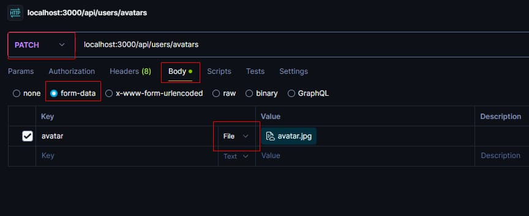

**Читати іншими мовами: [Русский](../README.md), [English](./README.en.md).**

# Завантаження файлів (аватарки) користувача за допомогою Multer.

---

Додавання можливості завантаження аватарки користувача через 'multer'. Генерація
стандартної аватарки під час реєстрації нового користувача за допомогою
бібліотеки gravatar. Додавання та оновлення розміру аватарки з пакетом 'jimp'
або 'sharp'. Написання unit-тестів для контролера входу (login/signin) з 'jest'.

---

### 1. Налаштування Express на роздачу статичних файлів.

1.1. Створюється папка **public** для роздачі статики. У цій папці створюється
папка **avatars**.

> Оскільки порожню папку на гіт запушити не можна, у папці **public/avatars**
> потрібно створити файл _`.gitkeep`_.

1.2. Налаштовується `Express` на роздачу статичних файлів з папки **public**.
Для цього в [app.js](../app.js) додається мідлвар
`app.use(express.static('public'));`.

1.3. Для перевірки, що роздача статики працює, розміщується будь-яке зображення
в папку **public/avatars**. При переході за таким URL браузер відобразить
зображення.

```js
http://localhost:<порт>/avatars/<ім'я файлу з розширенням>
```

---

### 2. Генерація аватарки з gravatar.

2.1. У схему користувача '[User](../models/user.js)' додається нова властивість
avatarURL для зберігання зображення.

```js
avatarURL: {
  type: String,
  required: false,
}
```

2.2. Для того щоб під час реєстрації нового користувача відразу згенерувати йому
аватар по його пошті використовується бібліотека
[gravatar](https://www.npmjs.com/package/gravatar).

2.3. Під час створення користувача, `url`, отриманий за допомогою `gravatar`,
зберігається в полі _`avatarURL`_.

---

### 3. Оновлення аватарки користувачем. Кастомізація аватара з пакетом jimp або sharp.

3.1. У корені проекту створюється папка **temp** для тимчасового зберігання
завантаженої користувачем аватарки.

3.2. Створюється ендпоінт [`/api/users/avatars`](#запит-на-оновлення-аватара).

3.3. Створюється і додається в маршрут мідлвар
[upload](../middlewares/upload.js), у якому налаштовується
`multer.diskStorage({})` для завантаження аватара в папку **temp**.

3.4. Створюється і додається в маршрут контролер
[updateAvatar](../controllers/users/updateAvatar.js).

3.5. За допомогою [jimp](https://www.npmjs.com/package/jimp) або
[sharp](https://www.npmjs.com/package/sharp) змінюється і задається розмір
аватара 250 на 250.

> Змінювати розмір аватара потрібно саме в папці **temp**, до перенесення в
> папку **public/avatars**, щоб у разі помилки, файл видалився, і користувач
> знову міг завантажити його.

3.6. Аватар користувача переноситься в папку **public/avatars**. Задається
унікальне ім'я для конкретного користувача.

3.7. Отриманий URL `/avatars/<ім'я файлу з розширенням>` зберігається в полі
[avatarURL](#відповідь-на-успішне-оновлення-аватара) користувача.

3.8. Запит користувача на зміну аватара



##### Запит на оновлення аватара

```js
@PATCH /api/users/avatars
Content-Type: multipart/form-data
Authorization: "Bearer {{token}}"
RequestBody: загруженный файл
```

##### Відповідь на успішне оновлення аватара

```js
Status: 200 OK
Content-Type: application/json
ResponseBody: {
  "avatarURL": "тут будет ссылка на изображение"
}
```

---

## Додаткове завдання

---

### 4. Unit-тестування контролера входу (signIn).

4.1. Пишуться unit-тести для контролера входу (login/signin) за допомогою
[jest](https://www.npmjs.com/package/jest) і
[supertest](https://www.npmjs.com/package/supertest). У _`package.json`_
потрібно вставити в поле `scripts` ключ: "test", значення: "jest".

```json
// package.json
"scripts": {
  "test": "jest"
}
```

4.2 Для запуску тестів використовується команда `yarn test`.

Тест має пройти такі пункти:

- Повертає успішну відповідь зі статус-кодом `200`.
- Перевіряє, що токен існує у відповіді.
- Перевіряє, що токен дійсно відповідає користувачеві.
- Перевіряє, що токен зберігається у користувача в 'MongoDB'
- У відповідь повертає користувача з полями 'email' і 'subscription'.
- Поле 'email' у відповіді повертається рядком.
- Поле 'email' у відповіді повертається рядком.
